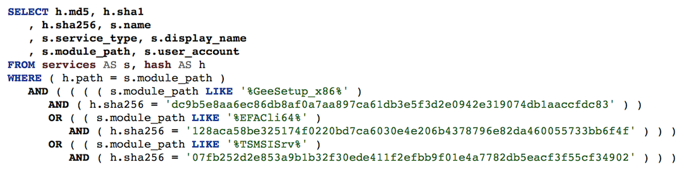

# prettysql
SQL Pretty printer using simplesql C++ library, with optional schema awareness

## Example
Turns this:

`select h.md5, h.sha1, h.sha256, s.name, s.service_type, s.display_name, s.module_path, s.user_account from services s, hash h where h.path = s.module_path and ((s.module_path like '%GeeSetup_x86%' and h.sha256 = 'dc9b5e8aa6ec86db8af0a7aa897ca61db3e5f3d2e0942e319074db1aaccfdc83') or (s.module_path like '%EFACli64%' and h.sha256 = '128aca58be325174f0220bd7ca6030e4e206b4378796e82da460055733bb6f4f') or (s.module_path like '%TSMSISrv%' and h.sha256 = '07fb252d2e853a9b1b32f30ede411f2efbb9f01e4a7782db5eacf3f55cf34902'));`

Into the following when you add some surrounding tags and [doc/sqlstyle.css](doc/sqlstyle.css) :



## Dependencies
- simplesql C++ library
  https://github.com/packetzero/simplesql
- antlr4 C++ runtime:
  `brew install antlr4-cpp-runtime`
- dyno
  https://github.com/packetzero/dyno
- rapidjson
  Add to CFLAGS: -DPRETTYSQL_JSON=1
  `brew install rapidjson`

## Build Without Tests
```
mkdir build && cd build
cmake
```

## Building for MacOS XCode

```
mkdir build && cd build
MAKE_TESTS=1 GTEST_DIR=/path/to/googletest cmake -G Xcode -DCMAKE_CXX_FLAGS=-DPRETTYSQL_JSON=1 ..
# either open project in Xcode and build/run
xcodebuild
```
